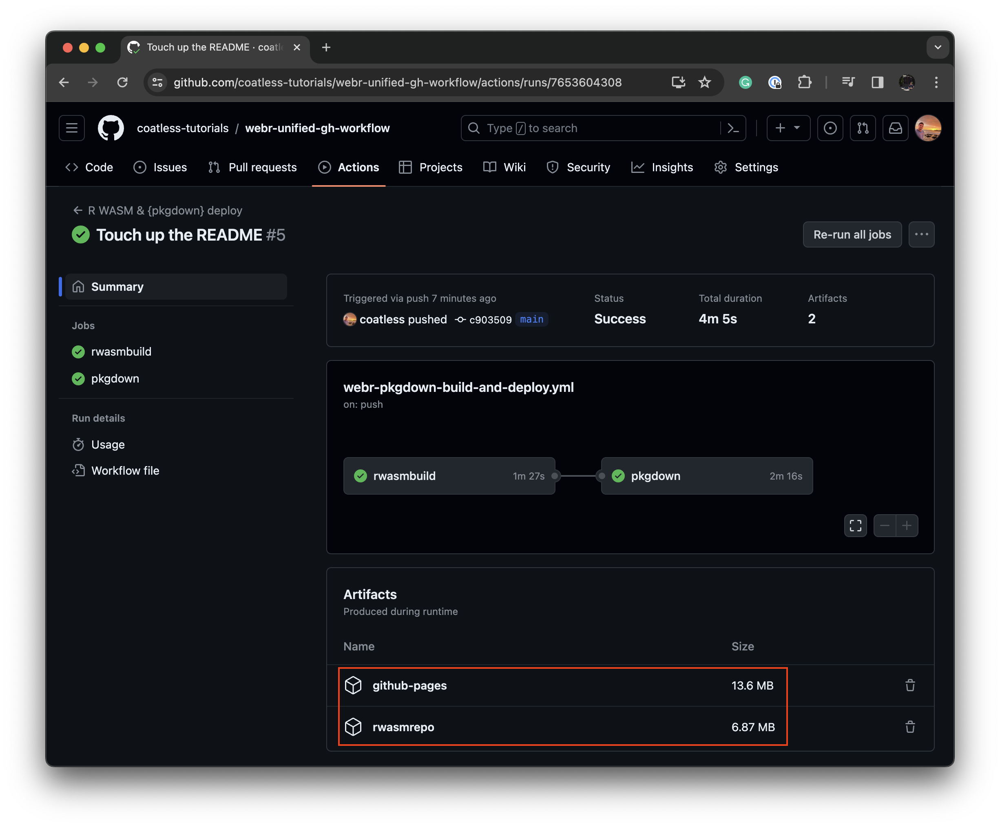

# Unified GH Action for webR/R WASM Package Binaries and {pkgdown} Deployment

<!-- badges: start -->

[](https://github.com/coatless-tutorials/webr-unified-gh-workflow/actions/workflows/R-CMD-check.yaml)
[](https://github.com/coatless-tutorials/webr-unified-gh-workflow/actions/workflows/webr-pkgdown-build-and-deploy.yml)
<!-- badges: end -->

## Introduction

Welcome to this tutorial on combining compiling an R package for
[webR](https://docs.r-wasm.org/webr/latest/) and creating a `{pkgdown}`
website using GitHub Actions. In this guide, you will find a sample
GitHub Action workflow designed to generate in one workflow both
developmental webR/R WASM Package binaries alongside a `{pkgdown}`
website. If you’re eager to streamline the process of building and
deploying your R packages for webR while also creating a `{pkgdown}`
website, you’ve come to the right place.

This repository is part of a series exploring three different
approaches:

- [Org-focused webR/WASM Package Repository without a `{pkgdown}`
  website](https://github.com/coatless-tutorials/webr-org-gh-action)
  - This repository serves as an example implementation of the webR
    Project’s [Build R packages using GitHub
    Actions](https://r-wasm.github.io/rwasm/articles/github-actions.html)
    documentation. It focuses on creating an organizational webR/WASM
    Package Repository without the inclusion of a `{pkgdown}` website
    that is meant to be triggered through workflow dispatches or changes
    to a `packages` file. Explore this repository for insights into
    structuring your own organization-centric webR package repository
    using GitHub Actions.
- **[Unified GitHub Action Deployment using artifacts of R WASM Package
  binaries and
  {pkgdown}](https://github.com/coatless-tutorials/webr-unified-gh-workflow)
  \[This repository\]**
  - This repository introduces a unified approach to GitHub Action
    deployment by using artifacts. Unlike the previous strategy, this
    allows for the simultaneous deployment of R WASM binaries and the
    associated `{pkgdown}` website by using artifacts. This approach
    helps prevent a continuous increase in repository size. Explore this
    repository to understand how the use of artifacts can streamline
    your deployment process while maintaining a clean and efficient
    version control history.
- [Separate GitHub Action Deployment onto `gh-pages` branch of R WASM
  Package binaries and {pkgdown}
  website](https://github.com/coatless-tutorials/webr-github-action-wasm-binaries)
  - This repository adopts a workflow approach familiar to R package
    developers using `usethis`. It employs separate GitHub Actions for
    generating the R WASM package binaries and `{pkgdown}` website. The
    key aspect of this approach is the merging and deployment of both
    outputs through the `gh-pages` branch. This strategy enhances
    clarity in tracking file changes and provides a transparent view of
    the deployed content. Explore this repository to understand how this
    approach can streamline your R package deployment workflow.

Another approach would be to use
[r-universe.dev](https://ropensci.org/blog/2023/11/17/runiverse-wasm/)
to automatically build and supply R WASM package binaries.

## Key Contents

Interested in having your R package automatically be built for
[webR](https://docs.r-wasm.org/webr/latest/) alongside a `{pkgdown}`
website using a [GitHub Action](https://github.com/features/actions)
that deploys with an **artifact** instead of a `gh-pages` branch? If so,
this is the repository for you! Here’s a summary of what you can find in
the repository:

- [`.github/workflows/webr-pkgdown-build-and-deploy.yml`](.github/workflows/webr-pkgdown-build-and-deploy.yml):
  A combined workflow leveraging the
  [`r-wasm/actions/build-rwasm`](https://github.com/r-wasm/actions/blob/d21bf7da50e539df543bbee973087ec585deaba6/build-rwasm/README.md)
  action to create R WASM packages,
  [`r-lib/actions/examples/pkgdown.yml`](https://github.com/r-lib/actions/blob/46e9e5f2d0dd3aa6ee94b8f49bcc146201e90959/examples/pkgdown.yaml)
  action to build a `{pkgdown}` website,
  [`actions/upload-artifact`](https://github.com/actions/upload-artifact)
  action to make available content in a later portion of the workflow,
  [`actions/download-artifact`](https://github.com/actions/download-artifact)
  action to retrieve a previously created artifact,
  [`actions/upload-pages-artifact`](https://github.com/actions/upload-pages-artifact)
  to upload an artifact onto GitHub Pages, and
  [`actions/deploy-pages`](https://github.com/actions/deploy-pages) to
  deploy the artifact onto GitHub Pages.
- [`_pkgdown.yml`](_pkgdown.yml): Usual configuration for a `{pkgdown}`
  website.
- [`DESCRIPTION`](DESCRIPTION): Standard description information for an
  R package
- [`R/in-webr.R`](R/in-webr.R): Check to see if we’re inside of webR or
  not.

## Deployment Strategy

This strategy diverges from the traditional approach of tracking website
deployments in a `gh-pages` branch. Instead, it opts for generating
artifacts through GitHub Actions and subsequently deploying them onto
GitHub Pages. This alteration ensures that the repository’s size remains
manageable even with the inclusion of a webR/R WASM Package binary.
However, it comes with the trade-off that changes related to new
`{pkgdown}` deployments are no longer tracked in the `gh-pages` branch.
The deployments can be downloaded and explored separately from a `tar`
file as discussed below.

## Setup

For the setup, we’re going to aim to use [`{usethis}` R
package](https://github.com/r-lib/usethis) to enable GitHub Pages and
retrieve a workflow for building both R WASM packages and `{pkgdown}`
websites.

### Setup Github Pages on the Repository

We can enable GitHub pages directly from `usethis` with:

``` r
if(!requireNamespace("usethis", quietly = TRUE)) {
  install.packages("usethis")
}

# Ensure GitHub Pages is set up
usethis::use_github_pages()
```

Another option is directly enabling GitHub Pages on the repository by
following:

1.  Click on the **Settings** tab for the repository
2.  Under “Code and automation”, select the **Pages** menu item.
3.  Under the “Source” option select **GitHub Actions** from the drop
    down.
4.  In the “Custom Domain” settings, make sure that **Enforce HTTPS** is
    checked.


### Setup the R WASM Package Build GitHub Action

Next, obtain a copy of the modified GitHub Action workflow that compiles
the R WASM package binaries and deploys them onto GitHub Pages by
committing into the `gh-pages` branch with the following R code:

``` r
# Obtain the modified version of the rwasm repo setup
usethis::use_github_action(
  "https://github.com/coatless-tutorials/webr-unified-gh-workflow/blob/main/.github/workflows/webr-pkgdown-build-and-deploy.yml"
)
```

Or, you can re-create what `usethis` is doing by using:

``` r
# Create the GitHub workflows directory if not present
dir.create(".github/workflows", showWarnings = FALSE, recursive = TRUE)

# Download the GitHub Action workflow into the repository
download.file(
  url = "https://github.com/coatless-tutorials/webr-unified-gh-workflow/blob/main/.github/workflows/webr-pkgdown-build-and-deploy.yml",
  destfile = ".github/workflows/webr-pkgdown-build-and-deploy.yml"
)

# Block R build from including the GitHub folder
writeLines(
  text = "^\.github$", 
  con = file(".Rbuildignore", "a") 
)
```

That’s it! Binaries alongside a `{pkgdown}` website will now be
automatically built upon each new commit and published on the
repository’s website served by GitHub Pages.

## Observing Data Uploaded

When the workflow completes, the packages and `{pkgdown}` website are
uploaded onto GitHub Pages through an artifact. The artifacts are stored
for 90 days (by default) and can be found under the workflow summary:

1.  Click on the **Actions** tab for the repository
2.  Under “All workflows”, select a the **R WASM & {pkgdown} deploy**
3.  Choose a completed workflow run


4.  Under “Artifacts”, click on **github-pages** to download the built R
    WASM repository and `{pkgdown}` website or **rwasmrepo** to download
    just the built R WASM repository.



**Note:** The size of the `github-pages` deployment is 13.6 MB of
compressed space, while the size of the `rwasmrepo` is only 6.87 MB of
the total compressed space.

## Accessing Binaries

In a webR session, access the built binaries using the repository’s
GitHub Pages URL, for example:

    https://gh-username.github.io/repo-name

Depending on where you are using the custom R WASM package binary, you
can register this repository in different ways:

1.  Using the `repos` key inside of the `quarto-webr` extension;
2.  Using `options()` to set values for both `repos` and
    `webr_pkg_repos`; or,
3.  Using the `repos` parameter in each `webr::install()` call.

### `repos` Document key in `{quarto-webr}`

With version v0.4.0 of the `{quarto-webr}` extension, the repository can
be included by using the [`repos` key in the document
header](https://quarto-webr.thecoatlessprofessor.com/qwebr-using-r-packages.html#custom-repositories):

``` md
---
webr:
  packages: ['pkgname']
  repos:
    - https://gh-username.github.io/repo-name
filters:
 - webr
---
```

### Specifying repo urls with `options()`

To define the location webR should search for in `options()`, we need to
set both `repos` and `webr_pkg_repos`.

``` r
## Run once at the start of the session

# Specify where to search for the R WASM packages
list_of_repos = c(
    "https://gh-username.github.io/repo-name", 
    "https://other-gh-username.github.io/another-repo", 
    "https://username.r-universe.dev", 
    "https://repo.r-wasm.org/"
  )

# Set the repository URLs
options(
  repos = list_of_repos,
  webr_pkg_repos = list_of_repos
)

# Install the R WASM Package
webr::install("pkgname")
```

> [!NOTE]
>
> This is different than the `repos` option one would usually set since
> webR only checks the [`webr_pkg_repos`
> key](https://github.com/r-wasm/webr/blob/010223433079d1a9ef3eb9bbf73d8eccb38e6adc/packages/webr/R/install.R#L23);
> however, other R functions like `available.packages()` check the
> `repos` parameter.

### Specifying `repos` in `webr::install()`

The `repos` parameter may also be specified in the `webr::install()`
command each time you need to install a package from a custom location:

``` r
webr::install("pkgname", repos = "https://gh-username.github.io/repo-name")

webr::install("pkgname", repos = list_of_repos)
```

> [!IMPORTANT]
>
> Ensure the repository’s [GitHub Pages website is available over
> `HTTPS`](https://docs.github.com/en/pages/getting-started-with-github-pages/securing-your-github-pages-site-with-https#enforcing-https-for-your-github-pages-site)
> (not `HTTP`). Verify this option in the repository’s **Settings** page
> under **Code and automation** \> **Pages** \> **Enforce HTTPS**.
>
> Otherwise, you might encounter an error:
>
>     Warning: unable to access index for repository http://gh-username.github.io/repo-name/bin/emscripten/contrib/4.3

## Verify

Go to the [webR REPL Editor](https://webr.r-wasm.org/v0.2.2/) (pinned to
v0.2.2) and run the following:

``` r
# Check if package `{demorwasmbinary}` is installed
"demorwasmbinary" %in% installed.packages()[,"Package"]
# Install the binary from a repository
webr::install(
  "demorwasmbinary", 
  repos = "https://tutorials.thecoatlessprofessor.com/webr-unified-gh-workflow/"
)
# Check to see if the function works
demorwasmbinary::in_webr()
# View help documentation
?demorwasmbinary::in_webr
```

You should receive:


